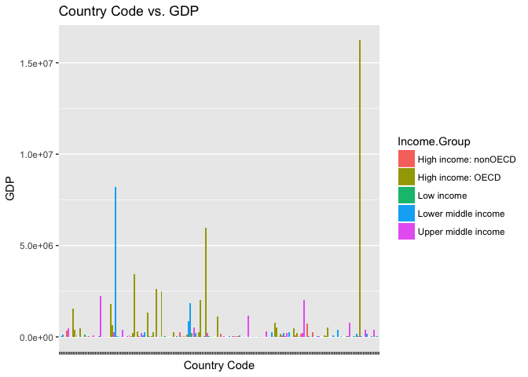

Case Study 1
================

Introduction
------------

For Case Study I, Group B performed an analysis based on two datasets, gross domestic product of 190 ranked countries and education data. The dataset comes from the world bank organization’s website. The two datasets have been combined and merged for the analysis. The data has merged based on the country short code, sorted in ascending order by GDP, and calculated the average GDP rankings for High income: nonOECD, High income: OECD, Low income, Lower middle income, and Upper middle income. For types of analysis performed, the GDP has been plotted and grouped into 5 separate quantile groups.

### First, we will download the data.

``` r
# Here we will set our working directory.
setwd("/Users/amber/Google Drive/MSDS/Doing Data Science/casestudy1/")

# This file will download the data and store it as data frame variables.
source("sources/gettingthedata.R", echo = TRUE, keep.source = TRUE)
```

    ## 
    ## > # First, we will put the URLs of the data into the variables gdpsite and educsite.
    ## > gdpsite<-"https://d396qusza40orc.cloudfront.net/getdata/data/GD ..." ... [TRUNCATED] 
    ## 
    ## > educsite<-"https://d396qusza40orc.cloudfront.net/getdata/data/EDSTATS_Country.csv"
    ## 
    ## > # Create a folder to put the data in:
    ## > dir.create("data")
    ## 
    ## > #Next, we download the files from both URLs:
    ## > download.file(gdpsite, destfile="data/GDP data.csv")
    ## 
    ## > download.file(educsite, destfile="data/education data.csv")
    ## 
    ## > # To verify that the data was downloaded, we will look at the dimensions and structure of each set.
    ## > gdpraw<-read.csv("data/GDP data.csv", header=F .... [TRUNCATED] 
    ## 
    ## > dim(gdpraw)
    ## [1] 331  10
    ## 
    ## > str(gdpraw)
    ## 'data.frame':    331 obs. of  10 variables:
    ##  $ V1 : chr  "" "" "" "" ...
    ##  $ V2 : chr  "Gross domestic product 2012" "" "" "Ranking" ...
    ##  $ V3 : logi  NA NA NA NA NA NA ...
    ##  $ V4 : chr  "" "" "" "Economy" ...
    ##  $ V5 : chr  "" "" "(millions of" "US dollars)" ...
    ##  $ V6 : chr  "" "" "" "" ...
    ##  $ V7 : logi  NA NA NA NA NA NA ...
    ##  $ V8 : logi  NA NA NA NA NA NA ...
    ##  $ V9 : logi  NA NA NA NA NA NA ...
    ##  $ V10: logi  NA NA NA NA NA NA ...
    ## 
    ## > educationraw<-read.csv("data/education data.csv", header=TRUE, sep=",")
    ## 
    ## > dim(educationraw)
    ## [1] 234  31
    ## 
    ## > str(educationraw)
    ## 'data.frame':    234 obs. of  31 variables:
    ##  $ CountryCode                                      : Factor w/ 234 levels "ABW","ADO","AFG",..: 1 2 3 4 5 6 7 8 9 10 ...
    ##  $ Long.Name                                        : Factor w/ 234 levels "American Samoa",..: 5 104 57 99 109 226 4 110 1 2 ...
    ##  $ Income.Group                                     : Factor w/ 6 levels "","High income: nonOECD",..: 2 2 4 5 6 2 6 5 6 6 ...
    ##  $ Region                                           : Factor w/ 8 levels "","East Asia & Pacific",..: 4 3 7 8 3 5 4 3 2 4 ...
    ##  $ Lending.category                                 : Factor w/ 4 levels "","Blend","IBRD",..: 1 1 4 4 3 1 3 2 1 3 ...
    ##  $ Other.groups                                     : Factor w/ 3 levels "","Euro area",..: 1 1 3 1 1 1 1 1 1 1 ...
    ##  $ Currency.Unit                                    : Factor w/ 155 levels "","Afghan afghani",..: 8 49 2 5 3 144 6 7 145 44 ...
    ##  $ Latest.population.census                         : Factor w/ 28 levels "","1970","1979",..: 17 28 3 2 18 22 18 18 17 18 ...
    ##  $ Latest.household.survey                          : Factor w/ 56 levels "","CPS (monthly)",..: 1 1 39 38 40 1 1 16 1 1 ...
    ##  $ Special.Notes                                    : Factor w/ 70 levels "","A simple multiplier is used to convert the national currencies of EMU members to euros. The following irrevocab"| __truncated__,..: 1 1 27 1 1 1 1 1 1 63 ...
    ##  $ National.accounts.base.year                      : Factor w/ 44 levels "","1954","1973",..: 25 1 38 28 1 25 22 1 1 18 ...
    ##  $ National.accounts.reference.year                 : int  NA NA NA NA 1996 NA NA 1996 NA NA ...
    ##  $ System.of.National.Accounts                      : int  NA NA NA NA 1993 NA 1993 1993 NA NA ...
    ##  $ SNA.price.valuation                              : Factor w/ 3 levels "","VAB","VAP": 1 1 2 3 2 2 2 2 1 2 ...
    ##  $ Alternative.conversion.factor                    : Factor w/ 33 levels "","1960-85","1965-84",..: 1 1 1 24 1 1 6 21 1 1 ...
    ##  $ PPP.survey.year                                  : int  NA NA NA 2005 2005 NA 2005 2005 NA NA ...
    ##  $ Balance.of.Payments.Manual.in.use                : Factor w/ 3 levels "","BPM4","BPM5": 1 1 1 3 3 2 3 3 1 3 ...
    ##  $ External.debt.Reporting.status                   : Factor w/ 4 levels "","Actual","Estimate",..: 1 1 2 2 2 1 2 2 1 1 ...
    ##  $ System.of.trade                                  : Factor w/ 3 levels "","General","Special": 3 2 2 3 2 2 3 3 1 2 ...
    ##  $ Government.Accounting.concept                    : Factor w/ 3 levels "","Budgetary",..: 1 1 3 1 3 3 3 3 1 1 ...
    ##  $ IMF.data.dissemination.standard                  : Factor w/ 3 levels "","GDDS","SDDS": 1 1 2 2 2 2 3 3 1 2 ...
    ##  $ Source.of.most.recent.Income.and.expenditure.data: Factor w/ 77 levels "","1-2-3, 2005-06",..: 1 1 1 35 66 1 45 46 1 1 ...
    ##  $ Vital.registration.complete                      : Factor w/ 2 levels "","Yes": 1 2 1 1 2 1 2 2 2 2 ...
    ##  $ Latest.agricultural.census                       : Factor w/ 45 levels "","1960","1964-65",..: 1 1 1 3 32 32 41 1 1 1 ...
    ##  $ Latest.industrial.data                           : int  NA NA NA NA 2005 NA 2001 NA NA NA ...
    ##  $ Latest.trade.data                                : int  2008 2006 2008 1991 2008 2008 2008 2008 NA 2007 ...
    ##  $ Latest.water.withdrawal.data                     : int  NA NA 2000 2000 2000 2005 2000 2000 NA 1990 ...
    ##  $ X2.alpha.code                                    : Factor w/ 208 levels "","AD","AE","AF",..: 13 2 4 8 6 3 9 7 10 5 ...
    ##  $ WB.2.code                                        : Factor w/ 209 levels "","AD","AE","AF",..: 13 2 4 8 6 3 9 7 10 5 ...
    ##  $ Table.Name                                       : Factor w/ 234 levels "Afghanistan",..: 10 5 1 6 2 220 8 9 4 7 ...
    ##  $ Short.Name                                       : Factor w/ 234 levels "Afghanistan",..: 10 5 1 6 2 220 8 9 4 7 ...

### Next, we will look at the data and clean it up a bit.

``` r
# This file will subset the data and clean it up.
source("sources/cleaningthedata.R", echo = TRUE, keep.source = TRUE)
```

    ## 
    ## > # The raw GDP data does not have descriptive variable names, so we rename them.
    ## > names(gdpraw)<-c("CountryCode", "ranking", "NA", "Country Name", " ..." ... [TRUNCATED] 
    ## 
    ## > # Only the columns with information are needed, so we create a subset with only those columns.
    ## > gdpdata<-subset(gdpraw, select=c("CountryCode", "ra ..." ... [TRUNCATED] 
    ## 
    ## > # The variables 'GDP' and 'ranking' are saved as strings and need to be changed into numeric values.
    ## > gdpdata$GDP<-as.numeric(gsub(",","",gdpdata$G .... [TRUNCATED]

    ## Warning in eval(ei, envir): NAs introduced by coercion

    ## 
    ## > gdpdata$ranking<-as.numeric(gdpraw$ranking)

    ## Warning in eval(ei, envir): NAs introduced by coercion

    ## 
    ## > # We are looking at the rankings of each country's GDP. Here we will see how many observations in the GDP data do not have a ranking.
    ## > sum(is.na(gd .... [TRUNCATED] 
    ## [1] 141
    ## 
    ## > # There are 141 observations without rankings. We only need the ranked information so we can subset our data to exclude non-ranked observations.
    ## > g .... [TRUNCATED] 
    ## 
    ## > # We know that there are 190 ranked countries and can verify that by checking the dimensions of the newly subsetted data:
    ## > dim(gdpdata) 
    ## [1] 190   4
    ## 
    ## > # We subset to keep only the data we're interested in: Country and Income Group.
    ## > educdata<-subset(educationraw, select=c("CountryCode", "Long.Name ..." ... [TRUNCATED] 
    ## 
    ## > # Verify that we have the information we expect to have by looking at the structure of our subsetted data.
    ## > str(educdata)
    ## 'data.frame':    234 obs. of  3 variables:
    ##  $ CountryCode : Factor w/ 234 levels "ABW","ADO","AFG",..: 1 2 3 4 5 6 7 8 9 10 ...
    ##  $ Long.Name   : Factor w/ 234 levels "American Samoa",..: 5 104 57 99 109 226 4 110 1 2 ...
    ##  $ Income.Group: Factor w/ 6 levels "","High income: nonOECD",..: 2 2 4 5 6 2 6 5 6 6 ...

### Then we'll merge the data.

From the merged data we will see that 189 country codes were matched, and the 13th observation when the data is ordered by ascending GDP is the country St. Kitts and Nevits.

For the High Income: OECD group, the average GDP is $1,483,917.13 and the average GDP ranking is 110.07.
For the High Income: non-OECD group, the average GDP is $104,249.83 and the average GDP ranking is 58.65.

``` r
# This file will merge the data.
source("sources/mergingthedata.R", echo = TRUE, keep.source = TRUE)
```

    ## 
    ## > # The data are merged by matching up each country code.
    ## > mergeddata<-merge(gdpdata, educdata, by="CountryCode")
    ## 
    ## > # We can look at the general structure of the merged data.
    ## > dim(mergeddata)
    ## [1] 189   6
    ## 
    ## > str(mergeddata)
    ## 'data.frame':    189 obs. of  6 variables:
    ##  $ CountryCode : chr  "ABW" "AFG" "AGO" "ALB" ...
    ##  $ ranking     : num  161 105 60 125 32 26 133 172 12 27 ...
    ##  $ Country Name: chr  "Aruba" "Afghanistan" "Angola" "Albania" ...
    ##  $ GDP         : num  2584 20497 114147 12648 348595 ...
    ##  $ Long.Name   : Factor w/ 234 levels "American Samoa",..: 5 57 99 109 226 4 110 2 15 111 ...
    ##  $ Income.Group: Factor w/ 6 levels "","High income: nonOECD",..: 2 4 5 6 2 6 5 6 3 3 ...
    ## 
    ## > head(mergeddata)
    ##   CountryCode ranking         Country Name    GDP
    ## 1         ABW     161                Aruba   2584
    ## 2         AFG     105          Afghanistan  20497
    ## 3         AGO      60               Angola 114147
    ## 4         ALB     125              Albania  12648
    ## 5         ARE      32 United Arab Emirates 348595
    ## 6         ARG      26            Argentina 475502
    ##                      Long.Name         Income.Group
    ## 1                        Aruba High income: nonOECD
    ## 2 Islamic State of Afghanistan           Low income
    ## 3  People's Republic of Angola  Lower middle income
    ## 4          Republic of Albania  Upper middle income
    ## 5         United Arab Emirates High income: nonOECD
    ## 6           Argentine Republic  Upper middle income
    ## 
    ## > # Only 189 of the country codes matched.
    ## > 
    ## > # We would like to see the data in order of increasing GDP.
    ## > sorteddata<-mergeddata[order(mergeddata$ .... [TRUNCATED] 
    ## 
    ## > str(sorteddata)
    ## 'data.frame':    189 obs. of  6 variables:
    ##  $ CountryCode : chr  "TUV" "KIR" "MHL" "PLW" ...
    ##  $ ranking     : num  190 189 188 187 186 185 184 183 182 181 ...
    ##  $ Country Name: chr  "Tuvalu" "Kiribati" "Marshall Islands" "Palau" ...
    ##  $ GDP         : num  40 175 182 228 263 326 472 480 596 684 ...
    ##  $ Long.Name   : Factor w/ 234 levels "American Samoa",..: 222 150 184 167 21 35 76 16 225 199 ...
    ##  $ Income.Group: Factor w/ 6 levels "","High income: nonOECD",..: 5 5 5 6 5 5 5 6 4 5 ...
    ## 
    ## > head(sorteddata)
    ##     CountryCode ranking                Country Name GDP
    ## 173         TUV     190                      Tuvalu  40
    ## 92          KIR     189                    Kiribati 175
    ## 113         MHL     188            Marshall Islands 182
    ## 137         PLW     187                       Palau 228
    ## 155         STP     186 S\xe3o Tom\xe9 and Principe 263
    ## 59          FSM     185       Micronesia, Fed. Sts. 326
    ##                                              Long.Name        Income.Group
    ## 173                                             Tuvalu Lower middle income
    ## 92                                Republic of Kiribati Lower middle income
    ## 113                   Republic of the Marshall Islands Lower middle income
    ## 137                                  Republic of Palau Upper middle income
    ## 155 Democratic Republic of S\xe3o Tom\xe9 and Principe Lower middle income
    ## 59                      Federated States of Micronesia Lower middle income
    ## 
    ## > # We expect the US to be last and verify that it is:
    ## > tail(sorteddata)
    ##     CountryCode ranking   Country Name      GDP
    ## 61          GBR       6 United Kingdom  2471784
    ## 58          FRA       5         France  2612878
    ## 45          DEU       4        Germany  3428131
    ## 87          JPN       3          Japan  5959718
    ## 34          CHN       2          China  8227103
    ## 178         USA       1  United States 16244600
    ##                                                Long.Name
    ## 61  United Kingdom of Great Britain and Northern Ireland
    ## 58                                       French Republic
    ## 45                           Federal Republic of Germany
    ## 87                                                 Japan
    ## 34                            People's Republic of China
    ## 178                             United States of America
    ##            Income.Group
    ## 61    High income: OECD
    ## 58    High income: OECD
    ## 45    High income: OECD
    ## 87    High income: OECD
    ## 34  Lower middle income
    ## 178   High income: OECD
    ## 
    ## > # The 13th country in this list is St. Kitts and Nevis.
    ## > sorteddata[13,]
    ##    CountryCode ranking        Country Name GDP           Long.Name
    ## 93         KNA     178 St. Kitts and Nevis 767 St. Kitts and Nevis
    ##           Income.Group
    ## 93 Upper middle income
    ## 
    ## > # We can check the average GDP  & rankings for each income group.
    ## > aggregate(ranking~Income.Group,data=sorteddata,FUN=mean)
    ##           Income.Group   ranking
    ## 1 High income: nonOECD  91.91304
    ## 2    High income: OECD  32.96667
    ## 3           Low income 133.72973
    ## 4  Lower middle income 107.70370
    ## 5  Upper middle income  92.13333
    ## 
    ## > aggregate(GDP~Income.Group,data=sorteddata,FUN=mean)
    ##           Income.Group        GDP
    ## 1 High income: nonOECD  104349.83
    ## 2    High income: OECD 1483917.13
    ## 3           Low income   14410.78
    ## 4  Lower middle income  256663.48
    ## 5  Upper middle income  231847.84

Plot of the data
----------------

We use a bar chart and tables to look at the different income groups and GDPs.

``` r
# This file will plot the data.
source("sources/plottingthedata.R", echo = TRUE, keep.source = TRUE)
```

    ## 
    ## > # We'll create a copy of our data to use for plotting.
    ## > plotdata <- sorteddata
    ## 
    ## > # This produces a bar plot of the data.
    ## > ggplot(plotdata, aes(plotdata$CountryCode, plotdata$GDP)) + geom_col(aes(fill = Income.Group)) + theme(axi .... [TRUNCATED]



    ## 
    ## > # We divide the data into 5 quantiles. 
    ## > plotdata$quantile<-quantcut(plotdata$ranking,5,labels=c("81-100%","61-80%","41-60%","21-40%","0-20%"))
    ## 
    ## > # Make sure quantile column was succesfully added
    ## > head(plotdata)
    ##     CountryCode ranking                Country Name GDP
    ## 173         TUV     190                      Tuvalu  40
    ## 92          KIR     189                    Kiribati 175
    ## 113         MHL     188            Marshall Islands 182
    ## 137         PLW     187                       Palau 228
    ## 155         STP     186 S\xe3o Tom\xe9 and Principe 263
    ## 59          FSM     185       Micronesia, Fed. Sts. 326
    ##                                              Long.Name        Income.Group
    ## 173                                             Tuvalu Lower middle income
    ## 92                                Republic of Kiribati Lower middle income
    ## 113                   Republic of the Marshall Islands Lower middle income
    ## 137                                  Republic of Palau Upper middle income
    ## 155 Democratic Republic of S\xe3o Tom\xe9 and Principe Lower middle income
    ## 59                      Federated States of Micronesia Lower middle income
    ##     quantile
    ## 173    0-20%
    ## 92     0-20%
    ## 113    0-20%
    ## 137    0-20%
    ## 155    0-20%
    ## 59     0-20%
    ## 
    ## > # This chart will allow us to see the number of countries from each quantile and income group.
    ## > xtabs(~Income.Group + quantile,plotdata)
    ##                       quantile
    ## Income.Group           81-100% 61-80% 41-60% 21-40% 0-20%
    ##                              0      0      0      0     0
    ##   High income: nonOECD       4      5      8      4     2
    ##   High income: OECD         18     10      1      1     0
    ##   Low income                 0      1      9     16    11
    ##   Lower middle income        5     13     11      9    16
    ##   Upper middle income       11      9      8      8     9

When the data is separated into quantiles, it can be seen that there are 5 countries with an income group of "Lower middle income" among the top 20% of nations with the highest GDP.

Conclusion
----------

The datasets were gathered from the world bank organization’s website. Then, it was cleansed and merged together. After those steps, the data was plotted and analyzed. Based on our analysis and plot, the income groups that are the two highest are high income: OECD and lower middle income. Refer to the key takeaways below for additional findings during this analysis.

Key Takeaways

1.  189 out of the 190 country codes have matched
2.  St. Kitts and Nevits is the 13th country in ascending order sorted by GDP.
3.  1.  High Income: OECD group, the average GDP is $1,483,917.13 and the average GDP ranking is 110.07
    2.  High Income: Non-OECD group, the average GDP is $104,249.83 and the average GDP ranking is 58.65.

4.  Refer to the plot above by Income Group
5.  There are 5 countries in the Lower middle income group that are among the top 20% of nations with the highest GDP.
